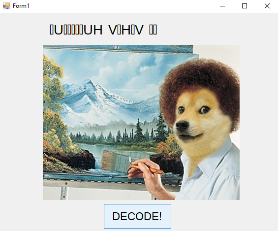
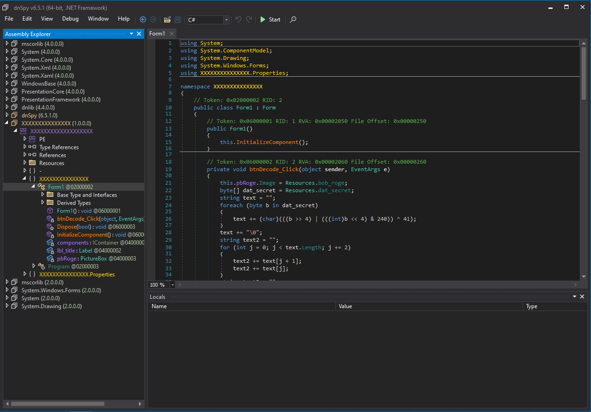
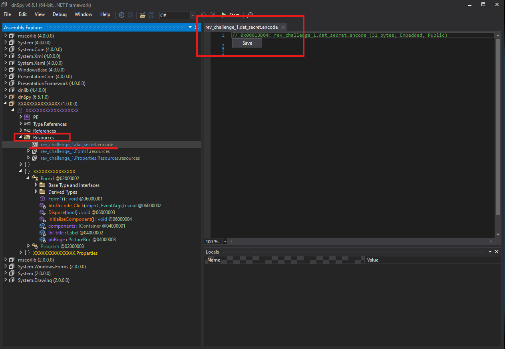

# 2014 Flare-On Challenge 1

*All the Flare-On annual challenges can be found [here](https://flare-on.com/).*

## Executive Summary
This write-up covers the first challenge of the 2014 Flare-On series. The objective is to extract the hidden flag from a 32-bit Windows executable. The solution involves static analysis of an unobfuscated .NET binary, extracting an embedded encrypted resource, and developing a Python script to reconstruct the decryption routine.

**Tools used:** dnSpy, Python 3, VS Code

---

## 1. Initial Triage (Dynamic Analysis)
Running the executable in an isolated environment reveals a standard .NET Windows Forms interface.


Clicking the "DECODE" button alters the image and displays a garbled text string. This indicates that a decryption or transformation routine is triggered by the button click event.



## 2. Static Analysis
Loading the executable into dnSpy confirms it is a standard, unobfuscated .NET assembly. The core logic of the application is easily locatable within the `btnDecode_Click` event handler.



Analyzing the `btnDecode_Click` function reveals the following C# routine:

```csharp
private void btnDecode_Click(object sender, EventArgs e)
{
    this.pbRoge.Image = Resources.bob_roge;
    byte[] dat_secret = Resources.dat_secret;
    string text = "";
    
    // Decoding routine
    foreach (byte b in dat_secret)
    {
        text += (char)(((b >> 4) | (((int)b << 4) & 240)) ^ 41);
    }
    text += "\0";
    
    string text2 = "";
    for (int j = 0; j < text.Length; j += 2)
    {
        text2 += text[j + 1];
        text2 += text[j];
    }
    
    string text3 = "";
    for (int k = 0; k < text2.Length; k++)
    {
        char c = text2[k];
        text3 += (char)((byte)text2[k] ^ 102);
    }
    this.lbl_title.Text = text3;
}
```

**Key Findings:**
1. The program loads an embedded byte array resource named `dat_secret`.
2. It performs a bitwise operation (bit shifting and XORing with `41`) on each byte to construct a string `text`.
3. The newly generated `text` string contains the actual flag, but the program subsequently mangles it (swapping characters and XORing with `102`) before displaying it in the UI (`this.lbl_title.Text`).

## 3. Payload Extraction and Algorithm Reconstruction
While dynamically patching the binary (e.g., modifying `this.lbl_title.Text = text;` and recompiling) is a viable solution, writing a standalone decryptor is a cleaner approach that fully demonstrates algorithm comprehension.

First, the `dat_secret` payload is extracted directly via dnSpy's resource manager and saved as `secret.encode`.



Next, the first `foreach` loop from the C# code is ported into a Python script to reproduce the initial decryption logic and output the unmangled flag.

## 4. Decryptor Script

```python
if __name__ == "__main__":
    with open("secret.encode", mode="rb") as secret_file:
        secret_data = secret_file.read()
        text = ""

        for letter in secret_data:
            text += chr(((letter >> 4) | ((letter << 4) & 0xF0)) ^ 41)
        text += "\0"
        
        print(text)
```

Executing this script successfully reveals the flag.