# 2015 Flare-On Challenge 3
*All the Flare-On annual challenges can be found [here](https://flare-on.com/).*

## Executive Summary
This write-up covers the third challenge of the 2015 Flare-On series. The objective is to extract a hidden flag from a Windows executable named `elfie`. The solution involves unpacking a PyInstaller bundle, identifying and stripping a tampered `.pyc` header to recover obfuscated Python source, iteratively peeling two layers of obfuscation. The first using base64-encoded chunks concatenated across hundreds of lines, the second a heavily obfuscated one-liner. And finally extracting the flag from reversed strings embedded in the final decoded payload.

**Tools used:** exiftool, DIE, pyinstxtractor, uncompyle6, HxD, Notepad++, Python

---

## 1. Initial Triage

The challenge file is named `elfie` with no extension. It's notably large. Running exiftool on it:

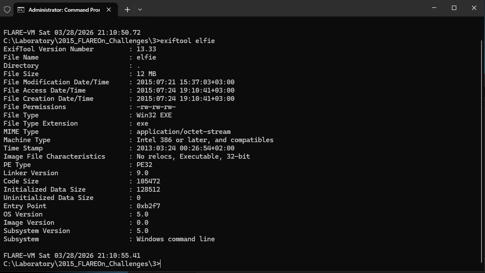

Not much detail here beyond the fact that it targets Windows. Running it through DIE:

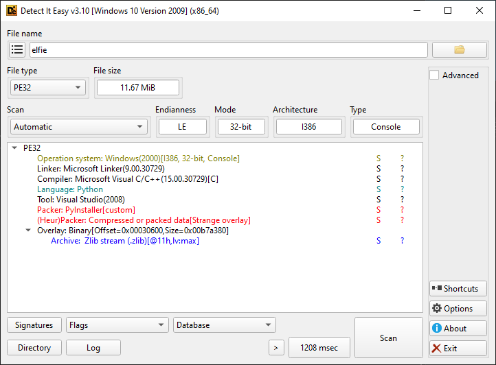

The size is explained immediately, it's a PyInstaller bundle. The binary is not a conventional executable but a self-contained Python application packed by PyInstaller.

## 2. Static Analysis

To work with the bundled Python code, the PyInstaller archive needs to be unpacked first. A quick search leads to [pyinstxtractor](https://github.com/extremecoders-re/pyinstxtractor), a purpose-built extraction script:

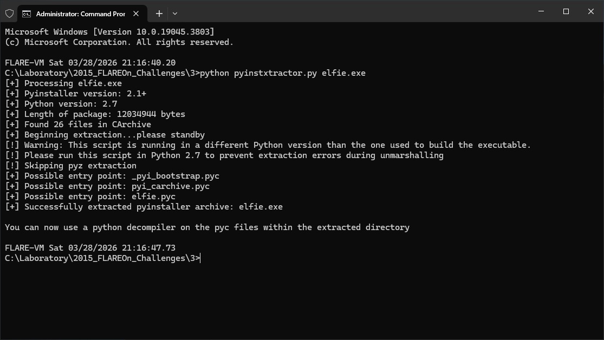

The script extracts the bundle successfully and suggests using a Python decompiler on the resulting `.pyc` files. The main target is `elfie.pyc`.

The tool of choice is `uncompyle6`, already available on the analysis machine. Running it against `elfie.pyc` immediately throws an error:

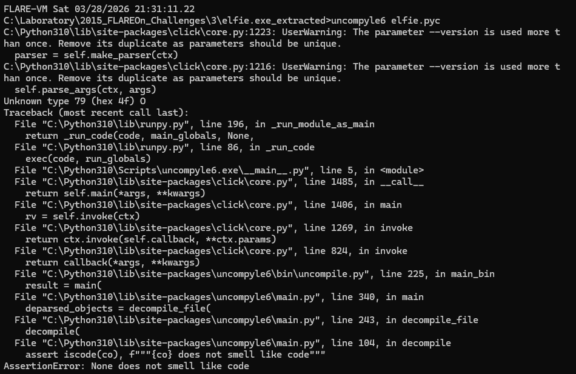

The key line is `Unknown type 79 (hex 0x4F)`, an invalid marshal type that causes uncompyle6 to abort. Before investigating `elfie.pyc` further, running the same command against `struct.pyc` (another file in the extracted directory) gives a clean result:

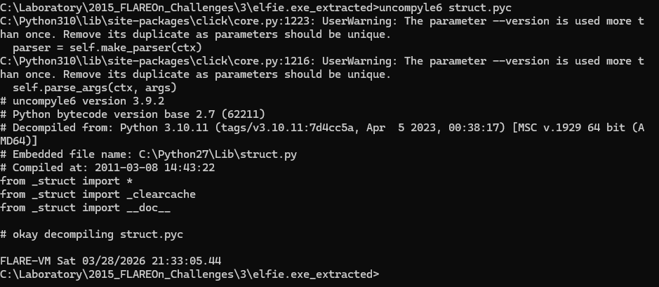

`struct.pyc` decompiles cleanly as Python 2.7's standard library `struct` module (magic number `62211`). It is legitimate, simply bundled alongside the application because it was built against Python 2.7. However, its presence in the extraction directory causes Python 3.10 to shadow its own `struct` module, which breaks any analysis tool that tries to import it. This explains subsequent `ImportError: bad magic number in 'struct'` errors that appear later.

Attempting to run `elfie.pyc` directly:

```powershell
PS C:\Laboratory\2015_FLAREOn_Challenges\3\elfie.exe_extracted > python .\elfie.pyc
RuntimeError: Bad magic number in .pyc file
```

This raises the question of whether the magic number in `elfie.pyc` has been tampered with. Comparing both files side by side in HxD:

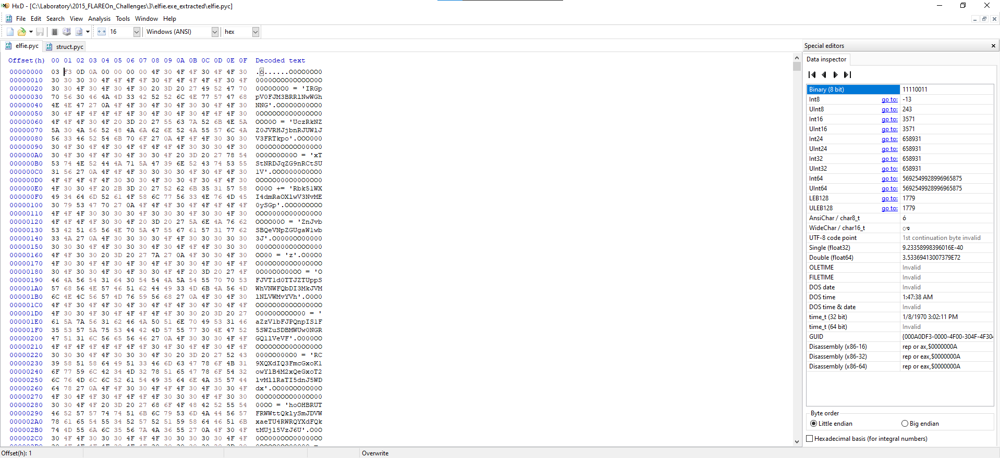

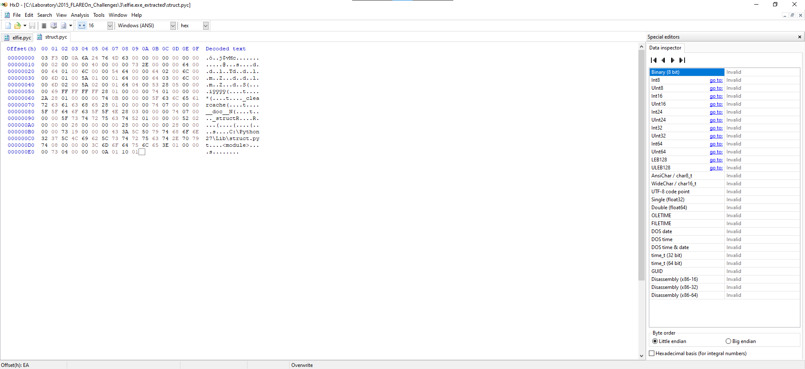

The first four bytes are identical (`03 F3 0D 0A`) the correct Python 2.7 magic. The header is not the problem. Looking past the 8-byte header at the marshal body tells a different story: instead of a valid code object starting with `0x63` (`c`), `elfie.pyc` starts with `0x4F 0x30 0x4F 0x4F...`, not a marshal stream at all. The ASCII column reveals readable text and what appear to be base64 strings. The marshal body has been **replaced with obfuscated Python source code**.

## 3. Dynamic Analysis (Kind of? Not really running the application)

Since `elfie.pyc` contains source rather than bytecode past its header, the approach is to strip the 8-byte `.pyc` header and treat the remainder as a Python script. The header is deleted in HxD and the file is saved as `elfie_body.py`.

Opening `elfie_body.py` in Notepad++:

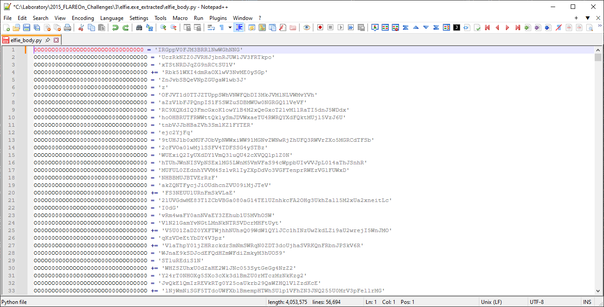

One issue immediately: a variable name starts with a digit, which is invalid Python syntax. This happened because one extra byte was deleted along with the header. The fix is to prepend an underscore:

```python
_0OO0OO00000OOOO0OOOOO0O00O0O0O0 = 'IRGppV0FJM3BRRlNwWGhNNG'
```

The structure of the file becomes clear: variable names composed entirely of `O` and `0` characters, visually indistinguishable, accumulate fragments of a base64 string across hundreds of lines, which are then concatenated and decoded:

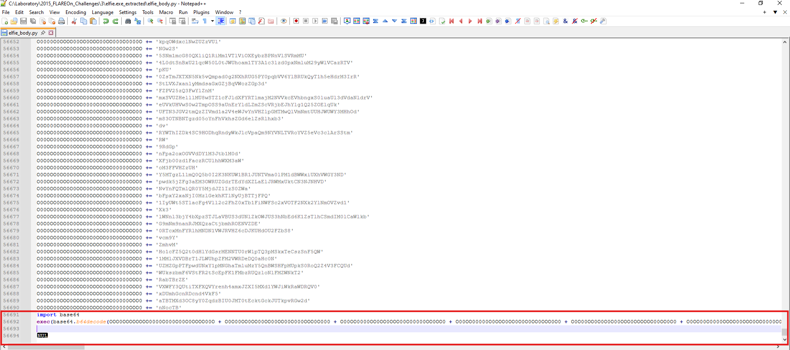

To safely observe what the script produces without executing the payload, the final `exec(...)` call is replaced with `print(...)`. The `NUL` byte at the end of the file is also removed.

Running the modified script from inside the extracted directory immediately hits the shadowed `struct` problem:

```powershell
PS C:\Laboratory\2015_FLAREOn_Challenges\3\elfie.exe_extracted > python .\elfie_body.py
ImportError: bad magic number in 'struct': b'\x03\xf3\r\n'
```

Moving `elfie_body.py` two directories up (away from the extracted folder) resolves the conflict since Python 3.10 can now find its own `struct` from the standard library.

The script runs successfully and produces a second, even more heavily obfuscated layer:

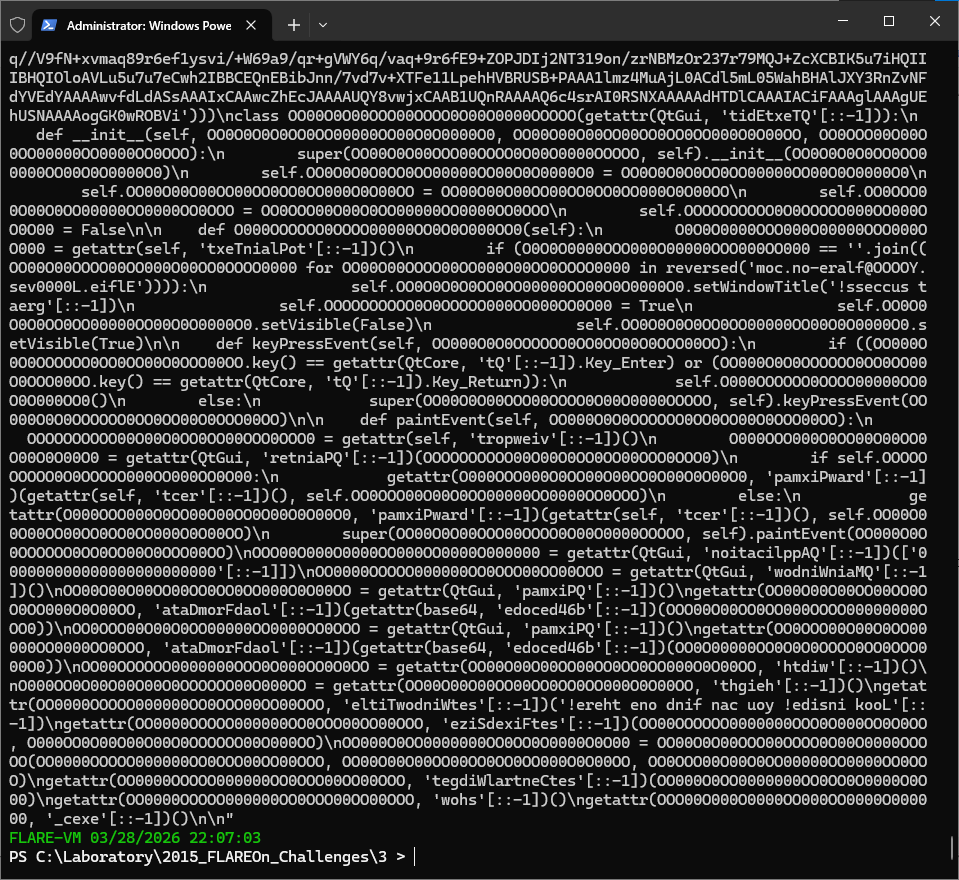

The output is a single massive one-liner. The code is copied into a new file and manually reformatted to make it readable. During the process of putting the code in order, the flag becomes visible, embedded as **reversed strings**, a further layer of obfuscation:

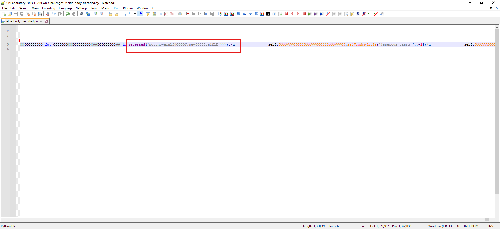

The full obfuscated structure with reversed string fragments visible:

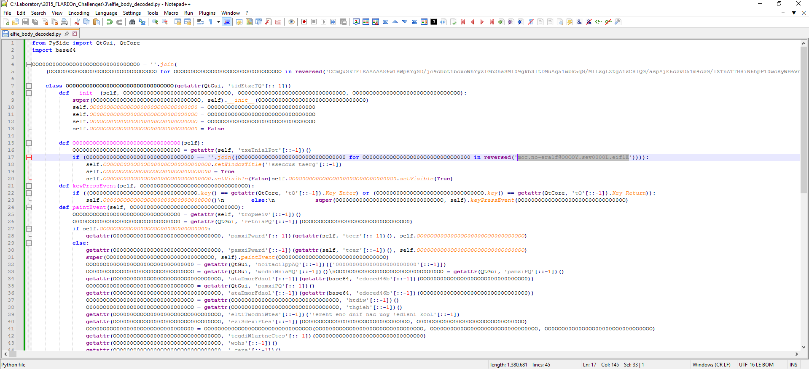

Reversing the string yields the flag.

## 4. Extracting the Flag

The flag was found embedded as a reversed string in the second layer of obfuscated Python code. Reversing it:

**`Elfie.L0000ves.YOOOO@flare-on.com`**

### Bonus: the embedded image

One large base64 blob in the obfuscated code did not appear to be part of the flag logic. Decoding it produces a binary file beginning with `\xFF\xD8`, a JPEG. Cross-referencing its usage in the code reveals it is passed to `loadFromData` (itself stored reversed as `ataDmorFdaol`), a Qt method for loading image data:

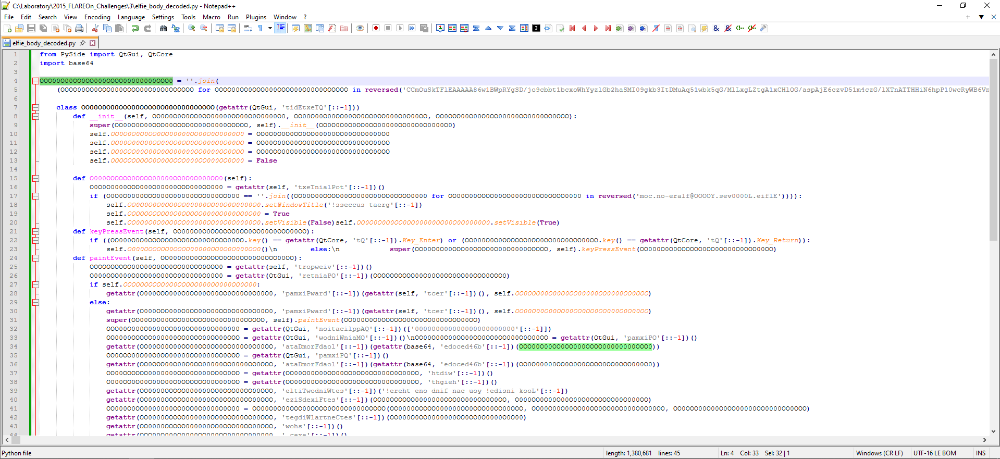

The blob is simply the goat image used as the application's mascot, no flag relevance.